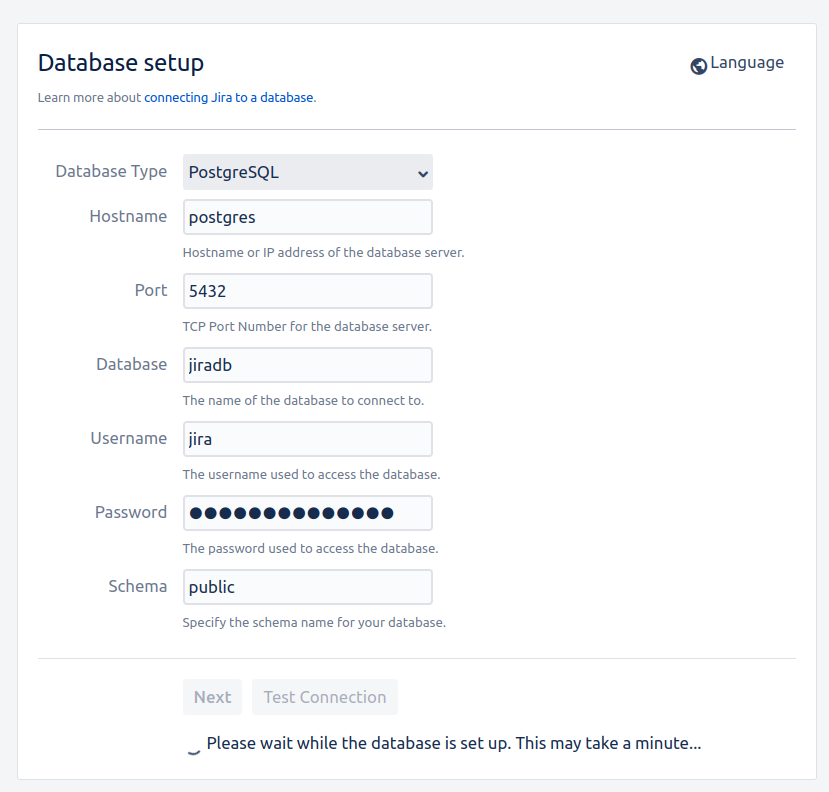

# Jira Docker Compose

Quickly spin up a Jira instance for testing purposes.

I find myself doing this when I was writing Jira MCP for my [other project](https://github.com/tuananh/hyper-mcp). Thought it might be useful to others too.

```sh
docker compose up -d
```

Then head over to `http://localhost:8080` to finish the setup


